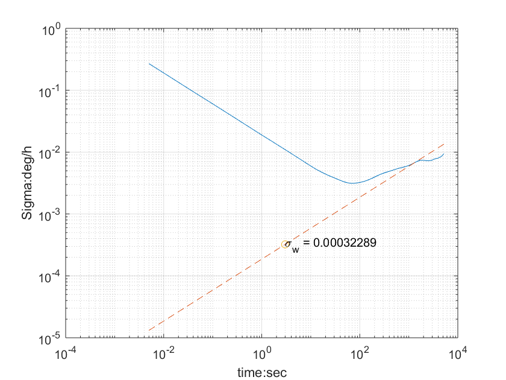

代码有两个压缩包,一个是ros, 一个非ros

#### 1. 对非 ros : 生成运动 imu 数据

1. 编译 ./build.sh

2. 执行bin/data_gen, 生成数据 

3. 执行python_tools/draw_trajectory.py 画出轨迹

4. 换成中值积分, 再重做一遍上述1,2,3过程

#### 2. 对ROS: 专门生成静止 imu 数据，用于 allan 方差标定
1. catkin_make and source devel/setup.bash
2. rosrun rosrun vio_data_simulation vio_data_simulation_node, 生成imu.bag,供标定包使用

##### 2.1 使用 imu_utils 完成 allan 标定

1. ros下编译(需要ceres-solve and code_utils)
2. 参见vio-data-simulation包的imu.bag生成
3. roslaunch imu_utils A3.launch, 启动 Allan曲线 绘制程序, A3.launch中需要修改max_time_min,该参数为imu.bag的观测时间, max_cluster为观测簇的大小.
   max_cluster设置可见matlab document https://www.mathworks.com/help/nav/ug/inertial-sensor-noise-analysis-using-allan-variance.html
4. rosbag play -r 200 imgimu_utils.bag 回放
5. 用imu_utils进行接收和分析(allan曲线生成正确,但是噪声标定错误,在matlab中根据allan曲线,从新完成标定)
6. 用imu_utils下的scripts/draw_allan_* 系列完成allan曲线绘制与标定

##### 2.2 使用 kalibr_allan 完成 allan 标定（推荐）

1. ros下编译 
2. 执行, 生成 imu.bag 
3. 用kalibr_allan的bagconver把bag转成 mat文件, 见readme
4. 用kalibr_allan的m脚本对mat文件进行分析, (需修改m文件中的mat文件路径)
5. 用kalibr_allan的m脚本画allan曲线, (需修改m文件中的result文件路径)

m 脚本运行需要matlab, 安装耗时,  最好提前做. 最好是2018版本
